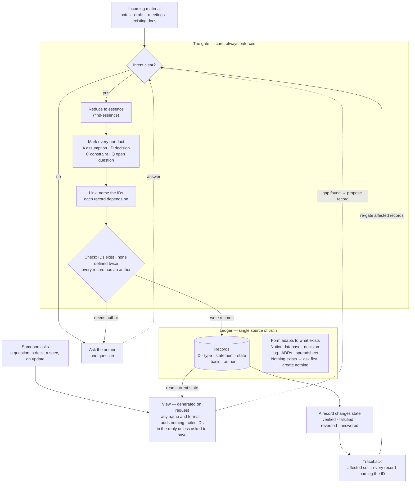

# Essence-Driven Product Development

Source of truth for two skills:

- **essence-driven-product-development** (EDPD) keeps a product's knowledge as one ledger of essence-form, marked, linked records (assumptions, decisions, constraints, open questions) in whatever system the team already uses, and answers every request for a document with a view generated from that ledger. The method is in [SKILL.md](essence-driven-product-development/SKILL.md).
- **find-essence** reduces text to the shortest version with the same meaning. EDPD uses it to reduce every statement, and it also works on its own. The method is in [SKILL.md](find-essence/SKILL.md).

Install both. EDPD does not work without find-essence.

## How EDPD works

*View on EDPD skill ledger, 2026-10-01 (EDPD-D7, EDPD-D9, EDPD-D11, EDPD-D12)*



## Layout

```
LEDGER.md                                     EDPD skill ledger: the records behind EDPD's rules
essence-driven-product-development/SKILL.md   EDPD
find-essence/SKILL.md                         find-essence
find-essence/references/fluff-patterns.md     fluff-pattern catalog used by find-essence
install.sh                                    symlink into ~/.claude/skills and/or ~/.codex/skills
package.sh                                    build dist/<skill>.zip for claude.ai upload
```

## Install locally

```bash
./install.sh claude
```

If the skills are also synced from claude.ai (`~/.claude/skills/synced/…`), both copies load; the script warns when it finds one.

## Publish to claude.ai

```bash
./package.sh
```

Upload `dist/essence-driven-product-development.zip` and `dist/find-essence.zip` in claude.ai's skill settings, replacing the current versions.

## Changing a skill

EDPD passes its own gate. A change to its rules starts as an entry in [LEDGER.md](LEDGER.md) (`EDPD-A`, `-D`, `-C`, `-Q`, with basis and author), and the rule text in SKILL.md follows from that entry. Entries are never deleted; they change state, with a dated log line.
